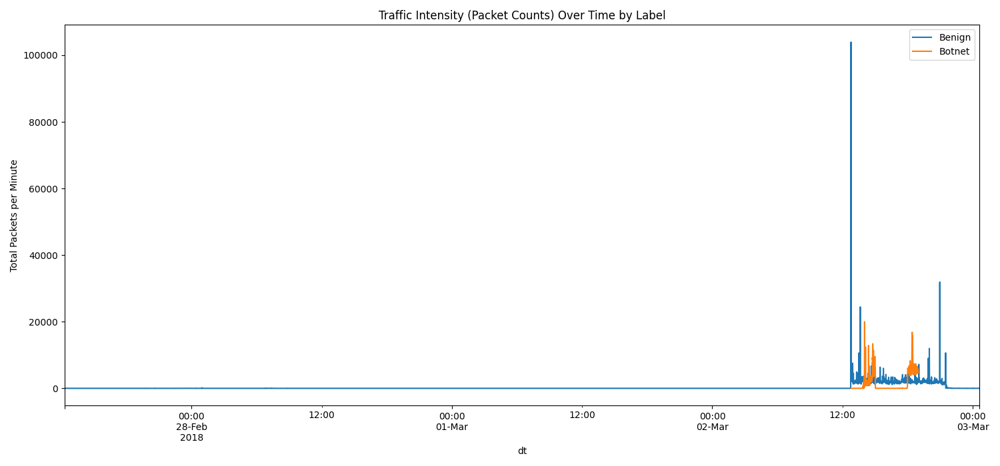
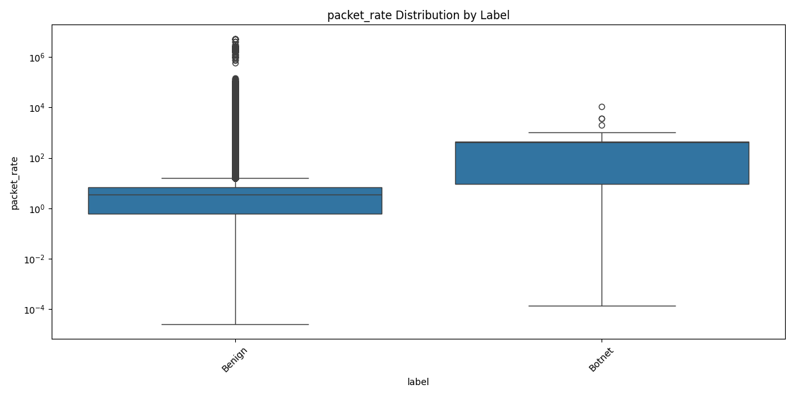
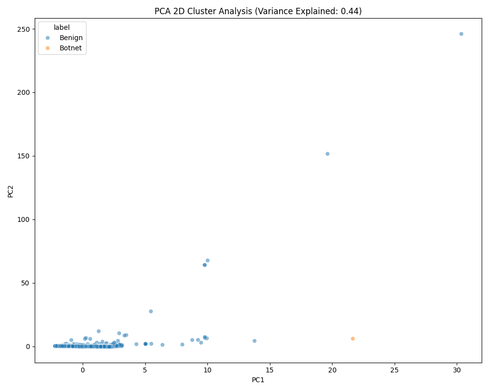
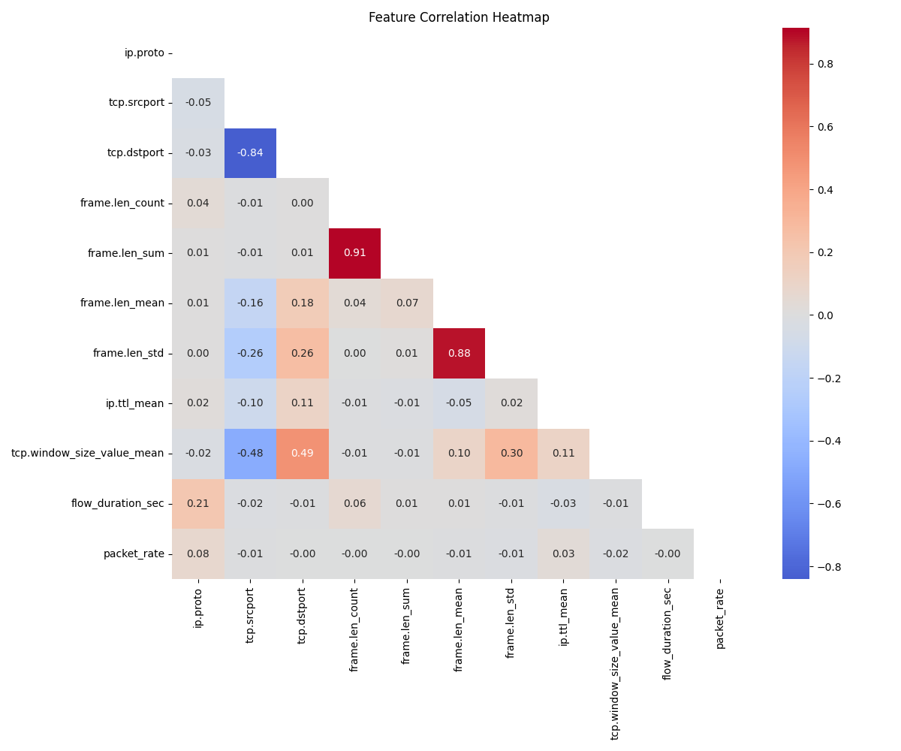

# Cyber Attack Analysis: Friday-02-03-2018 (Botnet)

This report explains the network traffic patterns observed during the **Botnet** attack simulation on March 2nd, 2018.

## 🕵️ What is a Botnet Attack?
A Botnet occurs when multiple computers (bots) are infected with malware and controlled by a single attacker (the "Botmaster"). These bots often communicate with a central Command & Control (C&C) server to receive instructions.

---

## 📊 Key Findings from our Analysis

### 1. Traffic Intensity (When did the attack happen?)

* **Observation**: The graph shows sudden and sharp spikes in network traffic, especially in the portions labeled as "Botnet". These spikes are significantly higher than normal traffic levels.

* **Simple Explanation**: Normal users generate traffic in a random and smooth manner (e.g., browsing, scrolling, clicking). In contrast, botnets are automated systems that send requests in a synchronized way. They often "heartbeat" or communicate with a command-and-control server at fixed intervals, resulting in sudden spikes.

* **Detailed Explanation**: When the botnet attack starts, a large number of infected devices begin sending packets simultaneously. This causes a massive increase in total traffic within a very short time. The spike observed in the graph is primarily due to coordinated malicious activity, not an increase in legitimate (benign) users. Benign traffic usually remains stable or may even decrease during such attacks. These periodic spikes are a strong indicator of botnet behavior and help identify the timing and presence of the attack.

### 2. Feature Comparison (How is it different from normal traffic?)

*   **Observation**: Botnet traffic often shows a higher and more consistent packet rate compared to Benign (normal) traffic.
*   **Simple Explanation**: Bots are machines—they send data much faster and more relentlessly than a human ever could.

### 3. PCA Cluster Analysis (The "Fingerprint")

*   **Observation**: Notice how the green points (Botnet) tend to group together in a different area of the map than the blue points (Benign).
*   **Simple Explanation**: This "map" shows the fingerprint of the network data. Because the green dots are mostly separated from the blue ones, our AI model will have an easier time distinguishing between an attack and a normal user.

### 2. Feature Correlation Analysis (What features are related?)

* **Observation**: The heatmap shows relationships between different network features. Some features have strong positive correlation (e.g., `frame.len_sum` and `frame.len_count`), while others show strong negative correlation (e.g., `tcp.srcport` and `tcp.dstport`).

* **Simple Explanation**: Correlation tells us how two features move together. A high positive value means both increase together, while a high negative value means one increases as the other decreases. Values close to 0 mean little or no relationship.

* **Detailed Explanation**: Strong positive correlations like between `frame.len_sum` and `frame.len_count` indicate that as the number of packets increases, the total packet size also increases, which is expected in normal traffic flow. Similarly, `frame.len_mean` and `frame.len_std` are also highly correlated, showing consistency in packet size distribution. On the other hand, negative correlations such as between `tcp.srcport` and `tcp.dstport` suggest an inverse relationship, often due to how communication endpoints are structured. Most other features show weak correlation, meaning they provide independent information. This is useful for building machine learning models, as less correlated features help improve model performance and reduce redundancy.

---

## 🛠️ Summary for the NIDS Model
The analysis confirms that the **Botnet** traffic has a distinct statistical signature in terms of **timing** and **frequency**. These are the "tells" that our XGBoost and Transformer models will use to protect the network.
