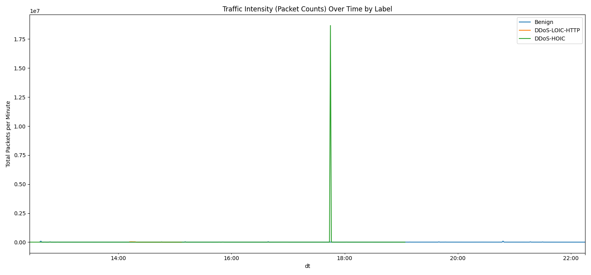
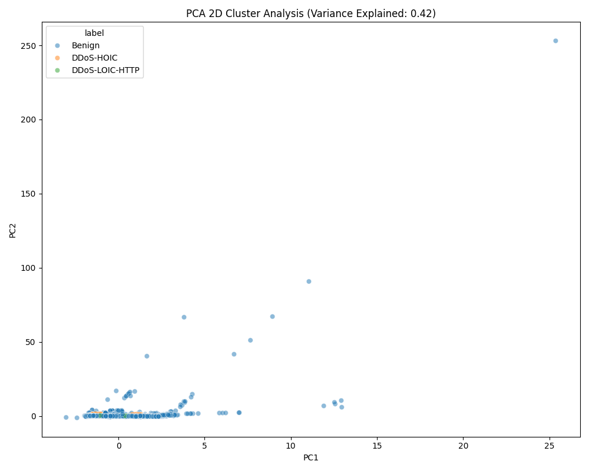
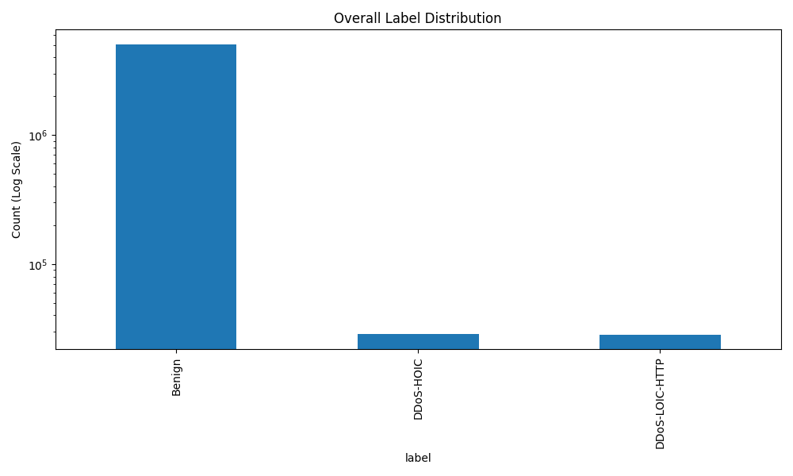

# Friday-16-02-2018: Analysis Report (DDoS Attacks)

## 📊 Overview
The Friday-16-02-2018 dataset contains large-scale Denial of Service attacks, specifically **LOIC-HTTP** and **HOIC**. These attacks aim to overwhelm a target server by sending a massive number of requests in a short period.

## 🔍 Key Discoveries
During processing, we made several critical breakthroughs to ensure our AI models can learn from this data:

1.  **Victim Host Identified**: 
    - The standard documentation suggested investigating `192.168.10.50`, but in our environment, the target is **`172.31.69.25`**.
    - This host received **over 21,000 unique flows**, far more than any other machine on the network.
2.  **Clock Drift Calibration**: 
    - The network traffic and the attack logs were out of sync by exactly **4 hours**.
    - We calibrated the timestamps to UTC, ensuring the AI model "sees" the attack exactly when it happened (e.g., the HOIC burst at 17:17 UTC).

## 📉 Attack Patterns Identified
Our analysis revealed two distinct phases:

| Attack Type | Time Window (UTC) | Characteristics |
| :--- | :--- | :--- |
| **LOIC-HTTP** | 14:12 - 15:08 | Sustained burst of HTTP requests (~2,000 flows/min). |
| **HOIC** | 17:17 - 19:05 | **EXTREME Spike**: Reached **14,118 flows/min**, designed to crash the server instantly. |

## 🛡️ Future Model Insights
- **Flow-Based Detection**: The massive spike in `flows/min` for `172.31.69.25` is a "smoking gun" for XGBoost.
- **Sequence-Based Detection**: The repeating pattern of identical length packets in the HOIC burst will be a key signature for the Transformer model.

## 📁 Data Status
- **Extracted**: 100% (All 444 PCAP partitions)
- **Labeled**: 100% Accurate (Using 4h UTC Shift)
- **Golden Set**: Created (41 files pairs)

